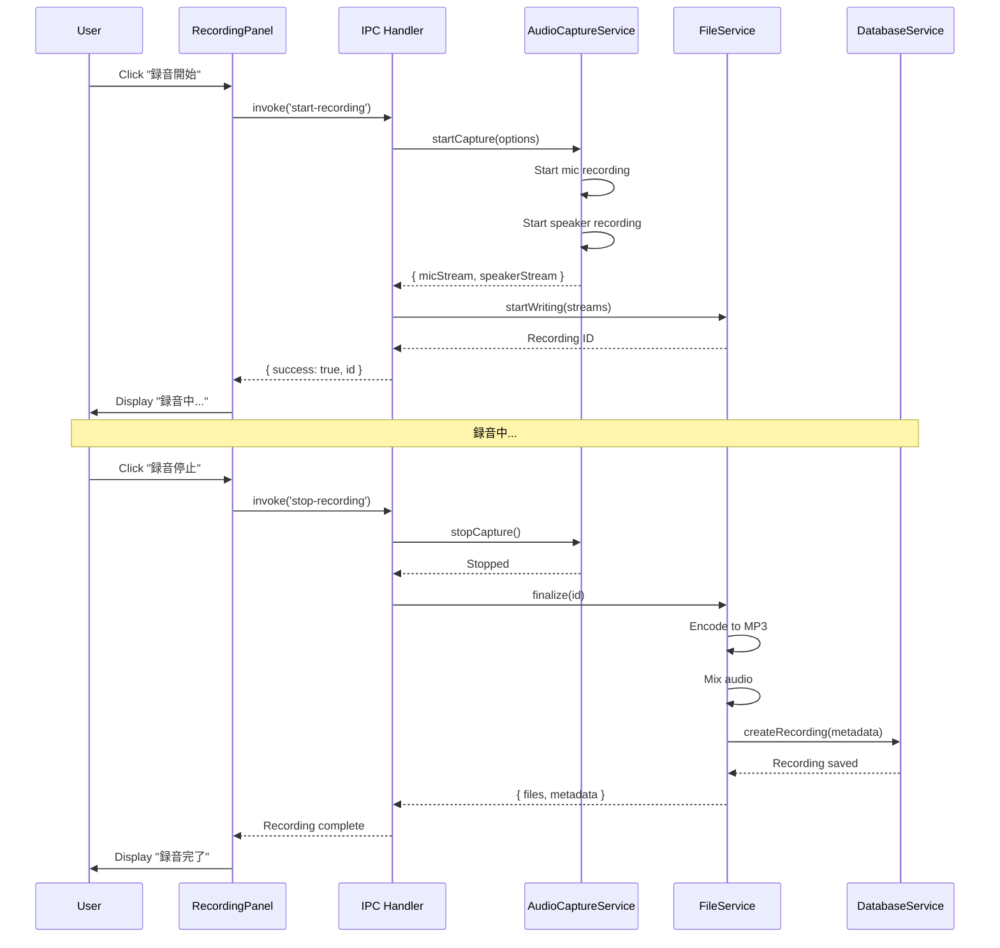

# システムアーキテクチャ設計書

作成日: 2025-11-17
バージョン: 1.0.0

## 1. 概要

録音アプリケーションのシステムアーキテクチャ詳細設計。Electronベースのマルチプロセスアーキテクチャを採用し、マイクとスピーカーの同時録音、3ファイル生成、ファイル管理、クラウド連携を実現する。

## 2. システム全体アーキテクチャ

### 2.1 レイヤー構成図

```
┌─────────────────────────────────────────────────────────────┐
│                    Presentation Layer                        │
│  ┌──────────────┐  ┌──────────────┐  ┌──────────────┐      │
│  │ Recording UI │  │ History UI   │  │ Settings UI  │      │
│  │  (React)     │  │  (React)     │  │  (React)     │      │
│  └──────────────┘  └──────────────┘  └──────────────┘      │
│                                                               │
│  ┌─────────────────────────────────────────────────┐        │
│  │         State Management (Zustand)              │        │
│  └─────────────────────────────────────────────────┘        │
└────────────────────────┬────────────────────────────────────┘
                         │ IPC Communication
┌────────────────────────▼────────────────────────────────────┐
│                    Application Layer                         │
│  ┌──────────────────────────────────────────────────┐       │
│  │              IPC Handler Layer                    │       │
│  │  - Recording Handlers                             │       │
│  │  - File Handlers                                  │       │
│  │  - Settings Handlers                              │       │
│  └──────────────────────────────────────────────────┘       │
└────────────────────────┬────────────────────────────────────┘
                         │
┌────────────────────────▼────────────────────────────────────┐
│                     Service Layer                            │
│  ┌─────────────┐  ┌─────────────┐  ┌─────────────┐         │
│  │   Audio     │  │  Encoding   │  │    File     │         │
│  │  Capture    │  │   Service   │  │   Service   │         │
│  │  Service    │  │             │  │             │         │
│  └─────────────┘  └─────────────┘  └─────────────┘         │
│                                                               │
│  ┌─────────────┐  ┌─────────────┐  ┌─────────────┐         │
│  │  Database   │  │   Cloud     │  │   Device    │         │
│  │  Service    │  │  Service    │  │   Manager   │         │
│  └─────────────┘  └─────────────┘  └─────────────┘         │
└────────────────────────┬────────────────────────────────────┘
                         │
┌────────────────────────▼────────────────────────────────────┐
│                   Infrastructure Layer                       │
│  ┌─────────────┐  ┌─────────────┐  ┌─────────────┐         │
│  │   SQLite    │  │  File       │  │  Audio      │         │
│  │   Database  │  │  System     │  │  Devices    │         │
│  └─────────────┘  └─────────────┘  └─────────────┘         │
│                                                               │
│  ┌─────────────┐  ┌─────────────┐                           │
│  │ Google      │  │  Dropbox    │                           │
│  │ Drive API   │  │    API      │                           │
│  └─────────────┘  └─────────────┘                           │
└─────────────────────────────────────────────────────────────┘
```

### 2.2 プロセスアーキテクチャ

```
┌────────────────────────────────────────────────────────────┐
│                      Main Process                          │
│  ┌──────────────────────────────────────────────────┐     │
│  │  Application Entry Point (main/index.ts)         │     │
│  │  - Window Management                              │     │
│  │  - IPC Handler Registration                       │     │
│  │  - System Tray                                    │     │
│  │  - Global Shortcuts                               │     │
│  └──────────────────────────────────────────────────┘     │
│                                                             │
│  ┌──────────────────────────────────────────────────┐     │
│  │            Service Layer (Node.js)                │     │
│  │  ┌─────────────────────────────────────────┐     │     │
│  │  │  AudioCaptureService                     │     │     │
│  │  │  - Microphone Capture                    │     │     │
│  │  │  - Speaker Capture (WASAPI/BlackHole)   │     │     │
│  │  │  - Audio Stream Management               │     │     │
│  │  └─────────────────────────────────────────┘     │     │
│  │                                                    │     │
│  │  ┌─────────────────────────────────────────┐     │     │
│  │  │  EncodingService                         │     │     │
│  │  │  - WAV → MP3 Conversion (FFmpeg)        │     │     │
│  │  │  - Quality Settings                      │     │     │
│  │  │  - Worker Thread Management              │     │     │
│  │  └─────────────────────────────────────────┘     │     │
│  │                                                    │     │
│  │  ┌─────────────────────────────────────────┐     │     │
│  │  │  FileService                             │     │     │
│  │  │  - File I/O                              │     │     │
│  │  │  - Metadata Management                   │     │     │
│  │  └─────────────────────────────────────────┘     │     │
│  │                                                    │     │
│  │  ┌─────────────────────────────────────────┐     │     │
│  │  │  DatabaseService (Prisma + SQLite)      │     │     │
│  │  │  - Recording CRUD                        │     │     │
│  │  │  - Settings CRUD                         │     │     │
│  │  └─────────────────────────────────────────┘     │     │
│  │                                                    │     │
│  │  ┌─────────────────────────────────────────┐     │     │
│  │  │  CloudService                            │     │     │
│  │  │  - Google Drive Upload                   │     │     │
│  │  │  - Dropbox Upload                        │     │     │
│  │  └─────────────────────────────────────────┘     │     │
│  └──────────────────────────────────────────────────┘     │
└────────────────────────┬───────────────────────────────────┘
                         │
                         │ IPC (contextBridge)
                         │
┌────────────────────────▼───────────────────────────────────┐
│                   Renderer Process                         │
│  ┌──────────────────────────────────────────────────┐     │
│  │          React Application (Chromium)            │     │
│  │  ┌────────────────────────────────────────┐     │     │
│  │  │  UI Components                         │     │     │
│  │  │  - RecordingPanel                      │     │     │
│  │  │  - LevelMeter (Web Audio API)          │     │     │
│  │  │  - HistoryList                         │     │     │
│  │  │  - SettingsPanel                       │     │     │
│  │  └────────────────────────────────────────┘     │     │
│  │                                                    │     │
│  │  ┌────────────────────────────────────────┐     │     │
│  │  │  State Management (Zustand)            │     │     │
│  │  │  - recordingStore                      │     │     │
│  │  │  - historyStore                        │     │     │
│  │  │  - settingsStore                       │     │     │
│  │  └────────────────────────────────────────┘     │     │
│  └──────────────────────────────────────────────────┘     │
└────────────────────────────────────────────────────────────┘
```

## 3. コンポーネント詳細設計

### 3.1 AudioCaptureService

**責務**: マイクとスピーカーの音声キャプチャ

```typescript
// src/main/services/AudioCaptureService.ts

interface AudioCaptureOptions {
  micDeviceId?: string;
  speakerDeviceId?: string;
  sampleRate: number;  // 44100 or 48000
  channels: number;    // 1 (mono) or 2 (stereo)
}

interface AudioStream {
  micStream: NodeJS.ReadableStream | null;
  speakerStream: NodeJS.ReadableStream | null;
}

class AudioCaptureService {
  private micRecorder: any;
  private speakerRecorder: any;
  private isCapturing: boolean = false;

  /**
   * 録音開始
   */
  async startCapture(options: AudioCaptureOptions): Promise<AudioStream> {
    // マイク録音開始
    this.micRecorder = record({
      sampleRate: options.sampleRate,
      channels: options.channels,
      device: options.micDeviceId
    });

    const micStream = this.micRecorder.stream();

    // スピーカー録音開始（プラットフォーム別）
    let speakerStream: NodeJS.ReadableStream;

    if (process.platform === 'win32') {
      // Windows: WASAPI loopback
      speakerStream = await this.captureWindowsSystemAudio(options);
    } else if (process.platform === 'darwin') {
      // macOS: BlackHole
      speakerStream = await this.captureMacSystemAudio(options);
    } else {
      throw new Error('Unsupported platform');
    }

    this.isCapturing = true;

    return {
      micStream,
      speakerStream
    };
  }

  /**
   * Windows システムオーディオキャプチャ
   */
  private async captureWindowsSystemAudio(
    options: AudioCaptureOptions
  ): Promise<NodeJS.ReadableStream> {
    const AudioCapture = require('node-audio-capture');

    const capture = new AudioCapture({
      device: 'loopback',
      sampleRate: options.sampleRate,
      channels: options.channels
    });

    capture.start();
    return capture.stream();
  }

  /**
   * macOS システムオーディオキャプチャ
   */
  private async captureMacSystemAudio(
    options: AudioCaptureOptions
  ): Promise<NodeJS.ReadableStream> {
    const portAudio = require('naudiodon');

    // BlackHoleデバイスIDを取得
    const devices = portAudio.getDevices();
    const blackhole = devices.find((d: any) =>
      d.name.includes('BlackHole')
    );

    if (!blackhole) {
      throw new Error('BlackHole not found. Please install BlackHole.');
    }

    const ai = new portAudio.AudioIO({
      inOptions: {
        channelCount: options.channels,
        sampleFormat: portAudio.SampleFormat16Bit,
        sampleRate: options.sampleRate,
        deviceId: blackhole.id
      }
    });

    ai.start();
    return ai;
  }

  /**
   * 録音停止
   */
  stopCapture(): void {
    if (this.micRecorder) {
      this.micRecorder.stop();
    }
    if (this.speakerRecorder) {
      this.speakerRecorder.stop();
    }
    this.isCapturing = false;
  }

  /**
   * 一時停止
   */
  pauseCapture(): void {
    // 実装: ストリームを一時停止
  }

  /**
   * 再開
   */
  resumeCapture(): void {
    // 実装: ストリームを再開
  }

  /**
   * 利用可能なデバイス一覧取得
   */
  getDevices(): { microphones: Device[]; speakers: Device[] } {
    const portAudio = require('naudiodon');
    const devices = portAudio.getDevices();

    return {
      microphones: devices.filter((d: any) => d.maxInputChannels > 0),
      speakers: devices.filter((d: any) => d.maxOutputChannels > 0)
    };
  }
}

export default new AudioCaptureService();
```

### 3.2 EncodingService

**責務**: WAVからMP3へのエンコーディング

```typescript
// src/main/services/EncodingService.ts

interface EncodingOptions {
  quality: 'standard' | 'high' | 'premium';
  inputPath: string;
  outputPath: string;
}

interface QualitySettings {
  sampleRate: number;
  bitrate: string;
}

class EncodingService {
  private qualityMap: Record<string, QualitySettings> = {
    standard: { sampleRate: 44100, bitrate: '128k' },
    high: { sampleRate: 48000, bitrate: '192k' },
    premium: { sampleRate: 48000, bitrate: '320k' }
  };

  /**
   * WAV → MP3 エンコーディング
   */
  async encode(options: EncodingOptions): Promise<string> {
    const { createFFmpeg } = require('@ffmpeg/ffmpeg');
    const fs = require('fs').promises;

    const ffmpeg = createFFmpeg({ log: false });
    await ffmpeg.load();

    // 入力ファイル読み込み
    const inputData = await fs.readFile(options.inputPath);
    ffmpeg.FS('writeFile', 'input.wav', inputData);

    // エンコーディング設定取得
    const settings = this.qualityMap[options.quality];

    // FFmpeg実行
    await ffmpeg.run(
      '-i', 'input.wav',
      '-codec:a', 'libmp3lame',
      '-ar', settings.sampleRate.toString(),
      '-b:a', settings.bitrate,
      'output.mp3'
    );

    // 出力ファイル保存
    const outputData = ffmpeg.FS('readFile', 'output.mp3');
    await fs.writeFile(options.outputPath, outputData);

    // 一時ファイル削除
    ffmpeg.FS('unlink', 'input.wav');
    ffmpeg.FS('unlink', 'output.mp3');

    return options.outputPath;
  }

  /**
   * Worker Threadでエンコーディング（非同期）
   */
  async encodeInBackground(options: EncodingOptions): Promise<void> {
    const { Worker } = require('worker_threads');

    return new Promise((resolve, reject) => {
      const worker = new Worker('./encoderWorker.js', {
        workerData: options
      });

      worker.on('message', resolve);
      worker.on('error', reject);
      worker.on('exit', (code) => {
        if (code !== 0) {
          reject(new Error(`Worker stopped with exit code ${code}`));
        }
      });
    });
  }

  /**
   * 2つの音声ファイルをミックス
   */
  async mixAudio(
    micPath: string,
    speakerPath: string,
    outputPath: string
  ): Promise<string> {
    const { createFFmpeg } = require('@ffmpeg/ffmpeg');
    const fs = require('fs').promises;

    const ffmpeg = createFFmpeg({ log: false });
    await ffmpeg.load();

    // ファイル読み込み
    const micData = await fs.readFile(micPath);
    const speakerData = await fs.readFile(speakerPath);

    ffmpeg.FS('writeFile', 'mic.mp3', micData);
    ffmpeg.FS('writeFile', 'speaker.mp3', speakerData);

    // ミックス実行
    await ffmpeg.run(
      '-i', 'mic.mp3',
      '-i', 'speaker.mp3',
      '-filter_complex', 'amix=inputs=2:duration=longest',
      'mixed.mp3'
    );

    // 出力保存
    const mixedData = ffmpeg.FS('readFile', 'mixed.mp3');
    await fs.writeFile(outputPath, mixedData);

    return outputPath;
  }
}

export default new EncodingService();
```

### 3.3 FileService

**責務**: ファイルI/O、メタデータ管理

```typescript
// src/main/services/FileService.ts

interface SaveOptions {
  fileName: string;
  memo?: string;
  quality: string;
}

interface RecordingFiles {
  micPath: string;
  speakerPath: string;
  mixedPath: string;
}

class FileService {
  private basePath: string;

  constructor() {
    // デフォルト保存先
    const { app } = require('electron');
    const path = require('path');
    this.basePath = path.join(app.getPath('documents'), 'Recordings');
  }

  /**
   * 保存先ディレクトリ初期化
   */
  async initialize(): Promise<void> {
    const fs = require('fs').promises;
    await fs.mkdir(this.basePath, { recursive: true });
  }

  /**
   * 録音ファイル保存
   */
  async saveRecording(
    streams: AudioStream,
    options: SaveOptions
  ): Promise<RecordingFiles> {
    const path = require('path');
    const fs = require('fs');

    // ファイル名生成
    const timestamp = this.generateTimestamp();
    const baseName = `${timestamp}_${options.fileName}`;

    // 一時WAVファイル保存
    const tempMicPath = path.join(this.basePath, `${baseName}_mic.wav`);
    const tempSpeakerPath = path.join(this.basePath, `${baseName}_speaker.wav`);

    // ストリームをファイルに書き込み
    await this.writeStreamToFile(streams.micStream, tempMicPath);
    await this.writeStreamToFile(streams.speakerStream, tempSpeakerPath);

    // MP3エンコーディング
    const micPath = path.join(this.basePath, `${baseName}_mic.mp3`);
    const speakerPath = path.join(this.basePath, `${baseName}_speaker.mp3`);
    const mixedPath = path.join(this.basePath, `${baseName}_mixed.mp3`);

    const encodingService = require('./EncodingService').default;

    await Promise.all([
      encodingService.encode({
        quality: options.quality,
        inputPath: tempMicPath,
        outputPath: micPath
      }),
      encodingService.encode({
        quality: options.quality,
        inputPath: tempSpeakerPath,
        outputPath: speakerPath
      })
    ]);

    // ミックス
    await encodingService.mixAudio(micPath, speakerPath, mixedPath);

    // 一時ファイル削除
    await fs.promises.unlink(tempMicPath);
    await fs.promises.unlink(tempSpeakerPath);

    // データベースに保存
    await this.saveToDatabase({
      fileName: baseName,
      micPath,
      speakerPath,
      mixedPath,
      memo: options.memo,
      quality: options.quality
    });

    return { micPath, speakerPath, mixedPath };
  }

  /**
   * ストリームをファイルに書き込み
   */
  private writeStreamToFile(
    stream: NodeJS.ReadableStream,
    filePath: string
  ): Promise<void> {
    const fs = require('fs');

    return new Promise((resolve, reject) => {
      const file = fs.createWriteStream(filePath);
      stream.pipe(file);
      file.on('finish', resolve);
      file.on('error', reject);
    });
  }

  /**
   * タイムスタンプ生成
   */
  private generateTimestamp(): string {
    const now = new Date();
    return `${now.getFullYear()}-${String(now.getMonth() + 1).padStart(2, '0')}-${String(now.getDate()).padStart(2, '0')}_${String(now.getHours()).padStart(2, '0')}${String(now.getMinutes()).padStart(2, '0')}${String(now.getSeconds()).padStart(2, '0')}`;
  }

  /**
   * データベースに保存
   */
  private async saveToDatabase(data: any): Promise<void> {
    const databaseService = require('./DatabaseService').default;
    await databaseService.createRecording(data);
  }

  /**
   * ファイル削除（論理削除）
   */
  async deleteRecording(id: number): Promise<void> {
    const databaseService = require('./DatabaseService').default;
    await databaseService.markAsDeleted(id);
  }

  /**
   * ファイルリネーム
   */
  async renameRecording(id: number, newName: string): Promise<void> {
    const databaseService = require('./DatabaseService').default;
    const path = require('path');
    const fs = require('fs').promises;

    // DBから現在のファイル情報取得
    const recording = await databaseService.getRecording(id);

    // 新しいファイル名生成
    const timestamp = recording.fileName.split('_')[0];
    const newBaseName = `${timestamp}_${newName}`;

    // ファイルリネーム
    const oldMicPath = recording.micPath;
    const newMicPath = path.join(
      path.dirname(oldMicPath),
      `${newBaseName}_mic.mp3`
    );

    await fs.rename(oldMicPath, newMicPath);
    // 同様にspeaker、mixedもリネーム...

    // DB更新
    await databaseService.updateRecording(id, {
      fileName: newBaseName,
      micPath: newMicPath
      // ...
    });
  }
}

export default new FileService();
```

### 3.4 DatabaseService

**責務**: SQLiteデータベース操作

```typescript
// src/main/services/DatabaseService.ts

import { PrismaClient } from '@prisma/client';

const prisma = new PrismaClient();

class DatabaseService {
  /**
   * 録音レコード作成
   */
  async createRecording(data: {
    fileName: string;
    micPath: string;
    speakerPath: string;
    mixedPath: string;
    duration: number;
    fileSize: number;
    memo?: string;
    quality: string;
  }) {
    return await prisma.recording.create({
      data: {
        fileName: data.fileName,
        filePath: data.mixedPath,  // メインファイルパス
        recordedAt: new Date(),
        duration: data.duration,
        fileSize: data.fileSize,
        memo: data.memo || '',
        quality: data.quality,
        isDeleted: false
      }
    });
  }

  /**
   * 録音一覧取得（論理削除除外）
   */
  async getRecordings(includeDeleted: boolean = false) {
    return await prisma.recording.findMany({
      where: includeDeleted ? {} : { isDeleted: false },
      orderBy: { recordedAt: 'desc' }
    });
  }

  /**
   * 録音詳細取得
   */
  async getRecording(id: number) {
    return await prisma.recording.findUnique({
      where: { id }
    });
  }

  /**
   * 録音更新
   */
  async updateRecording(id: number, data: any) {
    return await prisma.recording.update({
      where: { id },
      data: {
        ...data,
        updatedAt: new Date()
      }
    });
  }

  /**
   * 論理削除
   */
  async markAsDeleted(id: number) {
    return await prisma.recording.update({
      where: { id },
      data: {
        isDeleted: true,
        updatedAt: new Date()
      }
    });
  }

  /**
   * 設定取得
   */
  async getSetting(key: string): Promise<string | null> {
    const setting = await prisma.setting.findUnique({
      where: { key }
    });
    return setting?.value || null;
  }

  /**
   * 設定保存
   */
  async setSetting(key: string, value: string) {
    return await prisma.setting.upsert({
      where: { key },
      update: { value, updatedAt: new Date() },
      create: { key, value }
    });
  }
}

export default new DatabaseService();
```

## 4. データフロー

### 4.1 録音開始から保存までのフロー

```
User Action: "録音開始"ボタンクリック
    │
    ▼
[Renderer] RecordingPanel.tsx
    │ ipcRenderer.invoke('start-recording', options)
    ▼
[Main] IPC Handler
    │ recordingHandlers.handleStartRecording()
    ▼
[Main] AudioCaptureService
    │ startCapture() → マイク＆スピーカーストリーム取得
    ▼
[Main] FileService
    │ 一時WAVファイルに書き込み
    │ ↓
    │ EncodingService.encode() → MP3変換
    │ ↓
    │ EncodingService.mixAudio() → ミックス生成
    ▼
[Main] DatabaseService
    │ createRecording() → メタデータ保存
    ▼
[Renderer] State Update
    │ recordingStore.setRecording(false)
    │ historyStore.addRecording(newRecording)
    ▼
User Feedback: "録音完了"通知表示
```

### 4.2 録音履歴表示フロー

```
User Action: "履歴"タブクリック
    │
    ▼
[Renderer] HistoryList.tsx
    │ useEffect() → ipcRenderer.invoke('get-recordings')
    ▼
[Main] IPC Handler
    │ fileHandlers.handleGetRecordings()
    ▼
[Main] DatabaseService
    │ getRecordings() → SQLiteクエリ実行
    ▼
[Renderer] State Update
    │ historyStore.setRecordings(recordings)
    ▼
[Renderer] UI Update
    │ Table再レンダリング、録音リスト表示
```

## 5. シーケンス図

### 5.1 録音開始シーケンス



## 6. クラス設計

### 6.1 主要クラス図

```
┌─────────────────────────┐
│  AudioCaptureService    │
├─────────────────────────┤
│ - micRecorder           │
│ - speakerRecorder       │
│ - isCapturing: boolean  │
├─────────────────────────┤
│ + startCapture()        │
│ + stopCapture()         │
│ + pauseCapture()        │
│ + getDevices()          │
└─────────────────────────┘
           │
           ▼
┌─────────────────────────┐
│   EncodingService       │
├─────────────────────────┤
│ - qualityMap            │
├─────────────────────────┤
│ + encode()              │
│ + mixAudio()            │
│ + encodeInBackground()  │
└─────────────────────────┘
           │
           ▼
┌─────────────────────────┐
│     FileService         │
├─────────────────────────┤
│ - basePath: string      │
├─────────────────────────┤
│ + saveRecording()       │
│ + deleteRecording()     │
│ + renameRecording()     │
│ + initialize()          │
└─────────────────────────┘
           │
           ▼
┌─────────────────────────┐
│   DatabaseService       │
├─────────────────────────┤
│ - prisma: PrismaClient  │
├─────────────────────────┤
│ + createRecording()     │
│ + getRecordings()       │
│ + updateRecording()     │
│ + markAsDeleted()       │
│ + getSetting()          │
│ + setSetting()          │
└─────────────────────────┘
```

## 7. エラーハンドリング

### 7.1 エラー分類と対処

| エラー種別 | 発生タイミング | 対処方法 |
|-----------|--------------|---------|
| **デバイス未接続** | 録音開始時 | エラーメッセージ表示、デバイス選択画面へ誘導 |
| **BlackHole未インストール** (macOS) | 録音開始時 | インストールガイド表示 |
| **ディスク容量不足** | ファイル保存時 | 警告表示、保存先変更提案 |
| **エンコーディング失敗** | MP3変換時 | リトライ、失敗時はWAVで保存 |
| **クラウドアップロード失敗** | アップロード時 | リトライキュー追加、後で再試行 |

### 7.2 エラーハンドリング実装例

```typescript
// IPC Handler
ipcMain.handle('start-recording', async (event, options) => {
  try {
    const streams = await audioCaptureService.startCapture(options);
    return { success: true, streams };
  } catch (error) {
    if (error.message.includes('BlackHole not found')) {
      return {
        success: false,
        error: 'BLACKHOLE_NOT_INSTALLED',
        message: 'BlackHoleがインストールされていません。'
      };
    }

    return {
      success: false,
      error: 'UNKNOWN',
      message: error.message
    };
  }
});
```

## 8. セキュリティ考慮事項

### 8.1 Context Isolation

```typescript
// main/index.ts
const mainWindow = new BrowserWindow({
  webPreferences: {
    contextIsolation: true,
    nodeIntegration: false,
    preload: path.join(__dirname, '../preload/index.js')
  }
});
```

### 8.2 Preload Script

```typescript
// preload/index.ts
import { contextBridge, ipcRenderer } from 'electron';

contextBridge.exposeInMainWorld('electronAPI', {
  // 録音API
  startRecording: (options) => ipcRenderer.invoke('start-recording', options),
  stopRecording: () => ipcRenderer.invoke('stop-recording'),

  // ファイルAPI
  getRecordings: () => ipcRenderer.invoke('get-recordings'),
  deleteRecording: (id) => ipcRenderer.invoke('delete-recording', id),

  // イベントリスナー
  onRecordingProgress: (callback) => {
    ipcRenderer.on('recording-progress', (_, data) => callback(data));
  }
});
```

## 9. パフォーマンス最適化戦略

### 9.1 メモリ管理

- **ストリーミング処理**: バッファリングを最小限に
- **Worker Thread**: エンコーディングをメインスレッドから分離
- **定期的なGC**: 長時間録音時のメモリリーク防止

### 9.2 CPU使用率最適化

- **音声処理の効率化**: ネイティブモジュール優先使用
- **非同期処理**: 重い処理はPromise/async-awaitで非ブロッキング化

## 10. テスト戦略

### 10.1 単体テスト

```typescript
// tests/unit/AudioCaptureService.test.ts
describe('AudioCaptureService', () => {
  it('should start capture successfully', async () => {
    const options = {
      sampleRate: 48000,
      channels: 2
    };

    const streams = await audioCaptureService.startCapture(options);

    expect(streams.micStream).toBeDefined();
    expect(streams.speakerStream).toBeDefined();
  });
});
```

### 10.2 統合テスト

```typescript
// tests/integration/recording.test.ts
describe('Recording Flow', () => {
  it('should record and save successfully', async () => {
    // 録音開始
    await ipcRenderer.invoke('start-recording', { quality: 'high' });

    // 3秒待機
    await new Promise(resolve => setTimeout(resolve, 3000));

    // 録音停止
    const result = await ipcRenderer.invoke('stop-recording');

    expect(result.files.micPath).toExist();
    expect(result.files.speakerPath).toExist();
    expect(result.files.mixedPath).toExist();
  });
});
```

## 11. デプロイメント

### 11.1 ビルド設定

```json
// package.json
{
  "scripts": {
    "dev": "electron .",
    "build": "tsc && electron-builder",
    "build:win": "electron-builder --win",
    "build:mac": "electron-builder --mac"
  }
}
```

### 11.2 配布パッケージ

- **Windows**: NSIS インストーラー (.exe)
- **macOS**: DMG イメージ (.dmg)

## 12. 次のステップ

1. ✅ システムアーキテクチャ設計完了
2. 🔄 開発環境セットアップ
3. ⏭️ MVP実装開始

---

**バージョン履歴**:
- v1.0.0 (2025-11-17): 初版作成
